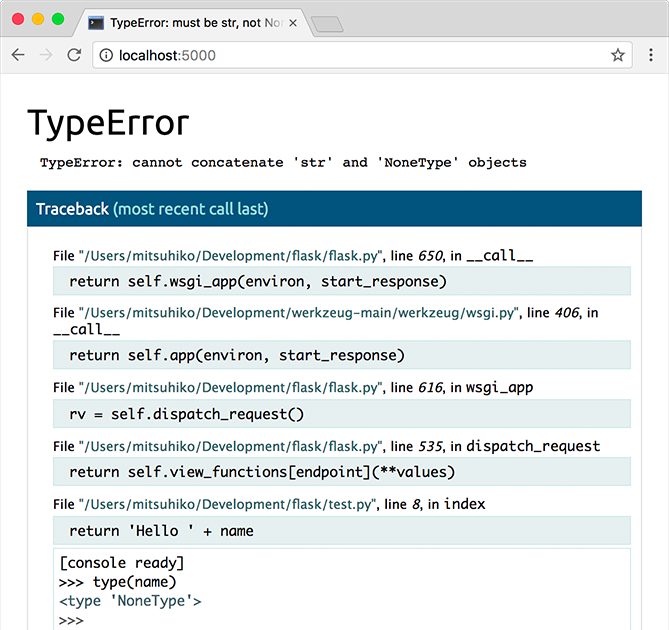

# Boshlash

Boshlashni xohlaysizmi? Ushbu sahifa Flaskga yaxshi kirish imkonini beradi. Loyihani o'rnatish va avval Flaskni o'rnatish uchun "O'rnatish" ga rioya qiling.

## Minimal dastur

Minimal Flask ilovasi quyidagicha ko'rinadi:

```python
from flask import Flask

app = Flask(__name__)

@app.route("/")
def hello_world():
    return "<p>Hello, World!</p>"
```

Xo'sh, bu kod nima qildi?

1. Avval biz Flask sinfini import qildik. Ushbu sinfning namunasi bizning WSGI ilovamiz bo'ladi.
2. Keyin biz ushbu sinfning namunasini yaratamiz. Birinchi argument dastur moduli yoki paketining nomidir. **\_\_name\_\_** - bu ko'p hollarda mos keladigan qulay yorliq. Bu Flask shablon va statik fayllar kabi resurslarni qayerdan qidirishni bilishi uchun kerak.
3. Keyin biz Flaskga qaysi URL bizning funktsiyamizni ishga tushirishi kerakligini aytish uchun route() dekoratoridan foydalanamiz.
4. Funktsiya foydalanuvchi brauzerida ko'rsatmoqchi bo'lgan xabarni qaytaradi. Standart kontent turi HTML, shuning uchun qatordagi HTML brauzer tomonidan ko'rsatiladi.

Uni hello.py yoki shunga o'xshash narsa sifatida saqlang. Ilovangizga flask.py nomi bilan saqlamang, chunki bu Flaskning o'ziga zid keladi.

Dasturni ishga tushirish uchun `flask` yoki `python -m flask` buyrug'idan foydalaning. Flaskga dasturingiz qayerda ekanligini `--app` argumenti bilan ko'rsating.

```bash
$ flask --app hello run
 * Serving Flask app 'hello'
 * Running on http://127.0.0.1:5000 (Press CTRL+C to quit)
```

Agar fayl `app.py` yoki `wsgi.py` nomi bilan saqlangan bo'lsa `--app` bilan dasturingiz qayerda ekanligini ko'rsatmasangiz ham bo'ladi.

Agar boshqa dastur 5000 port bilan ishlayotgan bo'lsa `OSError: [Errno 98]` yoki `OSError: [WinError 10013]` xatosini ko'rasiz.

Agar sizda debugger o'chirilgan bo'lsa yoki tarmog'ingizdagi foydalanuvchilarga ishonsangiz, buyruq satriga `--host=0.0.0.0` qo'shish orqali serverni hammaga ochiq qilishingiz mumkin:

```bash
$ flask run --host=0.0.0.0
```

Bu sizning operatsion tizimingizga barcha umumiy IP-larni tinglashni aytadi.

## Debug Mode

`flask run` buyrug'i development serverini ishga tushirishdan ko'ra ko'proq narsani qila oladi. Debug Mode'ni yoqish orqali, agar kod o'zgartirilsa, server avtomatik ravishda qayta yuklanadi va so'rov paytida xatolik yuzaga kelsa, brauzerda interaktiv debugger ko'rsatadi.

<figure><figcaption></figcaption></figure>

## <mark style="background-color:orange;">Ogohlantirish</mark>

<mark style="background-color:orange;">Debugger brauzerdan o'zboshimchalik bilan Python kodini bajarishga imkon beradi. U pin bilan himoyalangan, ammo baribir katta xavfsizlik xavfini anglatadi. Production muhitida devlopment serverini yoki debuggerni ishga tushirmang.</mark>

Debug Mode'ni yoqish uchun `--debug` argumentidan foydalaning

```bash
$ flask --app hello run --debug
 * Serving Flask app 'hello'
 * Debug mode: on
 * Running on http://127.0.0.1:5000 (Press CTRL+C to quit)
 * Restarting with stat
 * Debugger is active!
 * Debugger PIN: nnn-nnn-nnn
```

HTML-ni (Flask-dagi standart javob turi) qaytarayotganda, in'ektsiya hujumlaridan himoya qilish uchun ko'rsatilgan foydalanuvchi tomonidan taqdim etilgan qiymatlardan qochish kerak. Keyinchalik taqdim etilgan Jinja bilan yaratilgan HTML shablonlari buni avtomatik ravishda bajaradi.

Bu yerda ko'rsatilgan escape(), qo'lda ishlatilishi mumkin. Ko'pgina misollarda qisqalik uchun olib tashlangan, ammo ishonchsiz ma'lumotlardan qanday foydalanayotganingizdan doimo xabardor bo'lishingiz kerak.

```python
from markupsafe import escape

@app.route("/<name>")
def hello(name):
    return f"Hello, {escape(name)}!"
```

Agar foydalanuvchi `<script>alert("bad")<script>` nomini yuborishga muvaffaq bo'lsa, escaping uni foydalanuvchi brauzerida skriptni ishga tushirish o'rniga matn sifatida ko'rsatishga olib keladi.

Route'agi `<name>` URL manzilidan qiymatni oladi va uni funktsiyaga o'tkazadi. Ushbu o'zgaruvchan qoidalar quyida tushuntiriladi.

## Routing

Zamonaviy veb-ilovalar foydalanuvchilarga yordam berish uchun mazmunli URL-lardan foydalanadi. Agar sahifada eslab qolishlari va sahifaga bevosita tashrif buyurish uchun foydalanishlari mumkin bo'lgan mazmunli URL ishlatilsa, foydalanuvchilar sahifani yoqtirishlari va qaytib kelishlari ehtimoli ko'proq.

Funktsiyani URL manziliga ulash uchun route() dekoratoridan foydalaning.

```python
@app.route('/')
def index():
    return 'Index Page'

@app.route('/hello')
def hello():
    return 'Hello, World'
```

Siz ko'proq narsani qila olasiz! Siz URL qismlarini dinamik qilishingiz va funksiyaga bir nechta qoidalarni biriktirishingiz mumkin.

## O'zgaruvchan qoidalar

Bo'limlarni `<o'zgaruvchi_nomi>` bilan belgilash orqali URL manziliga o'zgaruvchilar bo'limlarini qo'shishingiz mumkin. Keyin funktsiyangiz kalit so'z argumenti sifatida `<variable_name>` ni oladi. _Ixtiyoriy_, argument turini belgilash uchun konvertordan foydalanishingiz mumkin, masalan, `<konvertor: o'zgaruvchan_nomi>`.

```python
from markupsafe import escape

@app.route('/user/<username>')
def show_user_profile(username):
    # show the user profile for that user
    return f'User {escape(username)}'

@app.route('/post/<int:post_id>')
def show_post(post_id):
    # show the post with the given id, the id is an integer
    return f'Post {post_id}'

@app.route('/path/<path:subpath>')
def show_subpath(subpath):
    # show the subpath after /path/
    return f'Subpath {escape(subpath)}'
```

Converter types:

| `string` | (standart) har qanday matnni slash belgisisiz qabul qiladi |
| -------- | ---------------------------------------------------------- |
| `int`    | musbat sonlarni qabul qiladi                               |
| `float`  | musbat haqiqiy sonlarni qabul qiladi                       |
| `path`   | `string` kabi, lekin slashlarni ham qabul qiladi           |
| `uuid`   | UUID satrlarini qabul qiladi                               |

